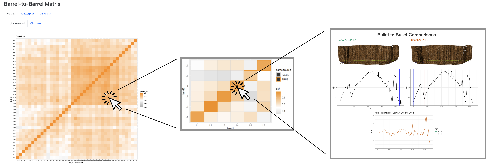

<!-- README.md is generated from README.Rmd. Please edit that file -->

```{r, include = FALSE}
knitr::opts_chunk$set(
  collapse = TRUE,
  comment = "#>"
)
```

# Houston-Persistence 

<!-- badges: start -->
<!-- badges: end -->

This repository is used as a writeup for visualizations for the Houston Persistence dataset. 


Quickstart: Just follow the link to

[Website for Barrel
A](https://heike.github.io/Houston-Persistence/barrel-tiles-with-maps.html)

<!--[Website for Barrel
D](https://heike.github.io/Houston-Persistence/docs/matrix-comparisons/matrix_D.html)-->

## Structure of the repo


## Linked View Comparisons

The visualization happens at multiple levels that are hyperlinked to allow the user quick navigation to "what's interesting".




### Barrel Visualizations

The barrel visualizations consist of a set of visualizations of different aspects of bullet-to-bullet comparisons.

Underlying data has the form:

XXX include a code chunk with the head of a file of the form bullet1 bullet2 phase_ccf

Bullets are enumerated from 11 to 50. These numbers reflect the shot order, i.e. bullet 11 denotes the eleventh bullet fired through this barrel. 
The similarity between two bullets is determined by their `phase_ccf` (explained belowin more detail). `phase_ccf` is a number in [0,1]. Higher values of `phase_ccf` indicate higher similarity between two bullets.  

In the visualizations, we focus on the order in which bullets are fired, the number of shots fired between bullets, as well as how similar bullets are to each other. The different visuals emphasize  these aspects differently.

The **Barrel Matrix** is a  tile map (clustered or unclustered).  Focus is on the position of of the bullet. Similarity is shown by color saturation.

The **Variogram** focuses on the relationship between the distance between fired bullets and their similarity to each other. We would expect that the similarity between two bullets (slowly) decreases with the use the barrel experiences between these two bullets, i.e. we would exptect to have the most similarity between bullets from successive fires, and the least similarity between bullets 11 and 50. 

The **Scatterplot** shows positions of each bullet along the `x` axis, and maps all of the comparison values with all other bullets on the `y` axis. In the clustered view, scores for the same bullet are connected by a line. This allows us to see, whether there are any clusters of bullets in the data and , in the case of that clusters exist, which bullets cluster with each other.

### Bullet Matrix

### Land-to-Land Comparisons


